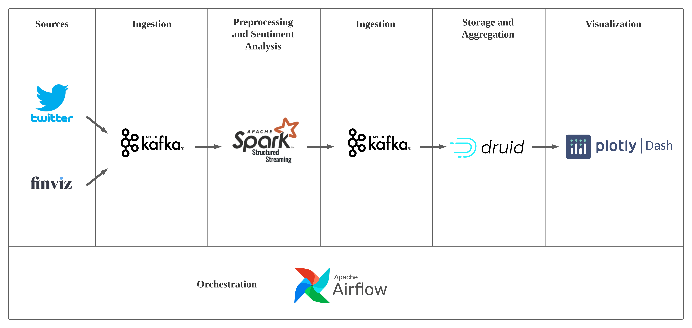
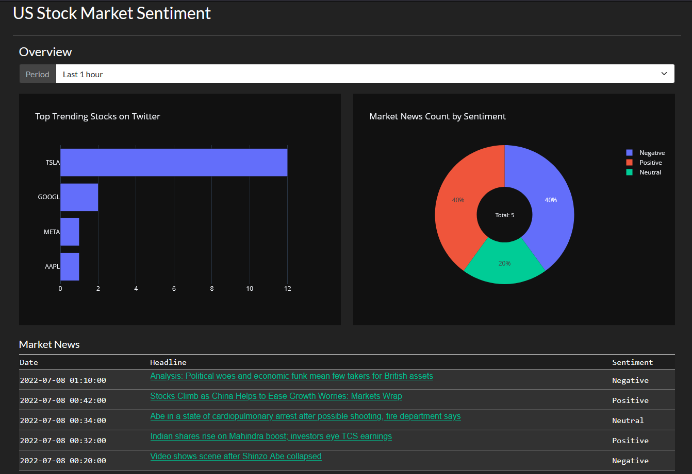
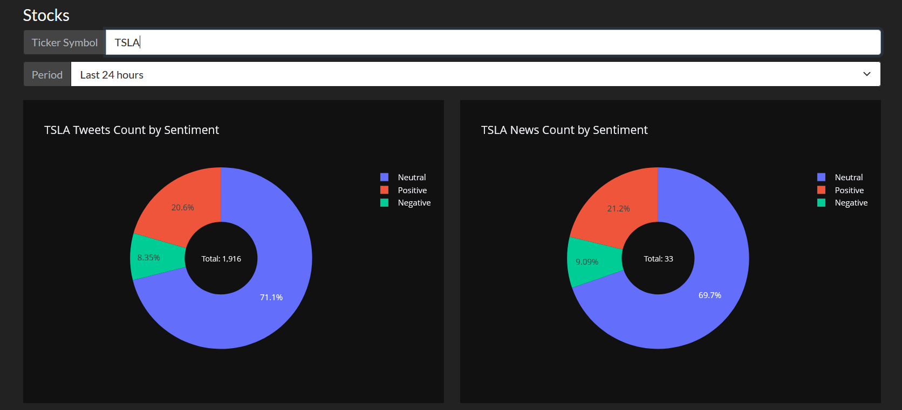
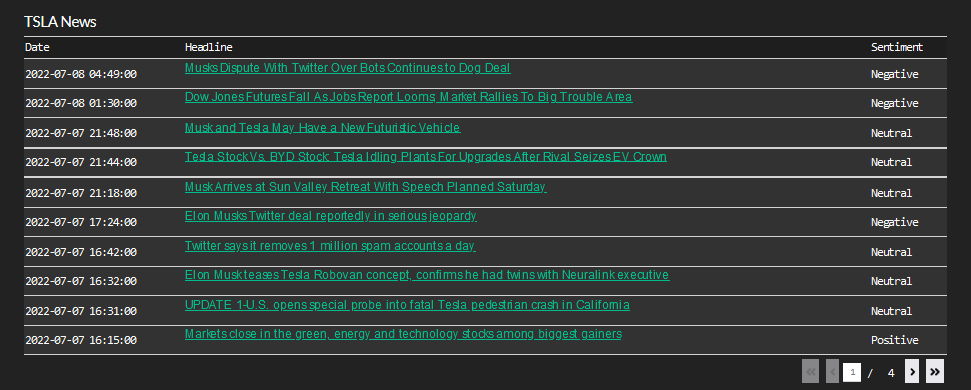
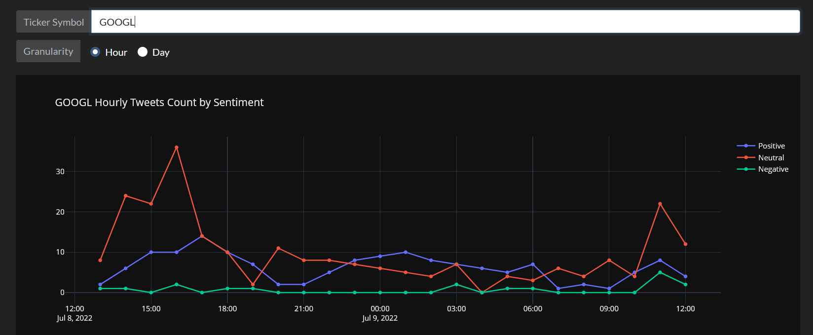

<div align="center">
  <h2 align="center">Stock Market Sentiment Analysis Pipeline</h2>
  <p align="center">
    An end-to-end data pipeline for sentiment analysis on the US stock market
  </p>
</div>

<details open="open">
  <summary><h3 style="display: inline-block">Table of Contents</h3></summary>
  <ol>
    <li>
      <a href="#about-the-project">About the Project</a>
      <ul>
        <li>
          <a href="#built-with">Built with</a>
        </li>
        <li>
          <a href="#architecture">Architecture</a>
        </li>
        <li>
          <a href="#dashboard">Dashboard</a>
        </li>
      </ul>
    </li>
    <li>
      <a href="#prerequisites">Prerequisites</a>
    </li>
    <li>
      <a href="#setup">Setup</a>
      <ul>
        <li>
          <a href="#installations">Installations</a>
        </li>
        <li>
          <a href="#other-configurations">Other Configurations</a>
        </li>
      </ul>
    </li>
    <li>
      <a href="#running">Running the Project</a>
    </li>
  </ol>
</details>

<h3 id="about-the-project">About the Project</h3>

This project aggregates data from multiple sources and generates insights about the US stock market by performing sentiment analysis on tweets and news headlines from [finviz.com](https://finviz.com/).

<h4 id="built-with">Built with</h4>

* [Apache Kafka](https://kafka.apache.org/)
* [Apache Spark](https://spark.apache.org/)
* [Apache Druid](https://druid.apache.org/)
* [Apache Airflow](https://airflow.apache.org/)
* [Plotly Dash](https://plotly.com/dash/)

<h4 id="architecture">Architecture</h4>
<div align="center">
  
</div>

<h4 id="dashboard">Dashboard</h4>
<div align="center">
  
</div>
<br>
<div align="center">
  
</div>
<br>
<div align="center">
  
</div>
<br>
<div align="center">
  
</div>

<h3 id="prerequisites">Prerequisites</h3>

* Ubuntu 22.04 LTS
* Python 3.10.4
* Java 8

<h3 id="setup">Setup</h3>

<h4 id="installations">Installations</h4>
Follow the installation and configuration guides provided below.

1. Confluent Platform
<br/>https://docs.confluent.io/platform/current/installation/installing_cp/zip-tar.html

2. Apache Spark
<br/>https://spark.apache.org/downloads.html

3. Apache Druid
<br/>https://druid.apache.org/docs/latest/tutorials/index.html

4. Apache Airflow
<br/>https://airflow.apache.org/docs/apache-airflow/stable/installation/index.html

5. MySQL
<br/>https://www.digitalocean.com/community/tutorials/how-to-install-mysql-on-ubuntu-22-04

6. Python packages
  ```sh
  pip install -r requirements.txt
  ```

<h4 id="other-configurations">Other Configurations</h4>

1. Both Confluent Platform and Apache Druid are bundled with Apache ZooKeeper. To prevent Apache Druid from running its Apache ZooKeeper server, open <b>apache-druid-0.22.1/conf/supervise/single-server/micro-quickstart.conf</b> and comment out `!p10 zk bin/run-zk conf`.

2. In order to run multiple tasks in parallel with Apache Airflow, first [set up MySQL as Apache Airflow's backend database](https://airflow.apache.org/docs/apache-airflow/stable/howto/set-up-database.html#setting-up-a-mysql-database). Then, open <b>airflow/airflow.cfg</b>, search for `executor` variable, and change its value from `SequentialExecutor` to `LocalExecutor`.

<h3 id="running">Running the Project</h3>

1. Start Apache ZooKeeper
  ```sh
  confluent-7.1.1/bin/zookeeper-server-start confluent-7.1.1/etc/kafka/zookeeper.properties
  ```

2. Start Apache Kafka
  ```sh
  confluent-7.1.1/bin/kafka-server-start confluent-7.1.1/etc/kafka/server.properties
  ```

3. Start Apache Druid
  ```sh
  apache-druid-0.22.1/bin/start-micro-quickstart
  ```

4. Start Apache Airflow scheduler
  ```sh
  sudo service mysql start
  airflow scheduler
  ```

5. Run the dag
  ```sh
  airflow dags unpause etl_dag
  ```

6. Start Plotly Dash
  ```sh
  python3 scripts/dashboard.py
  ```

7. Open the dashboard with a browser at [localhost:8050](http://localhost:8050)
